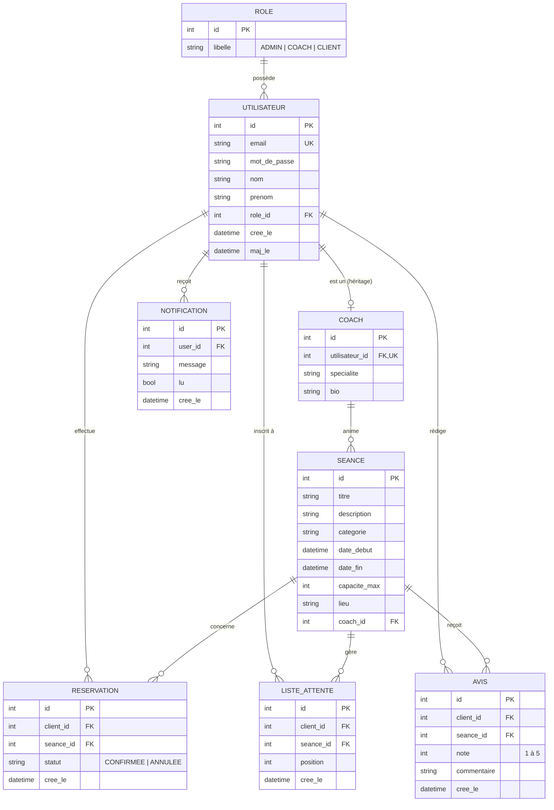

# MCD - Modèle Conceptuel de Données (Merise) - Sportify Pro

## Cardinalités (Merise)

| Association                   | Cardinalité         | Sens                                                          |
|-------------------------------|---------------------|---------------------------------------------------------------|
| ROLE ↔ UTILISATEUR            | 1,1 — 0,n           | Un utilisateur a 1 rôle ; un rôle peut être porté par n users |
| UTILISATEUR ↔ COACH           | 0,1 — 1,1           | Un utilisateur peut être 0 ou 1 coach (héritage 1-1)          |
| COACH ↔ SEANCE                | 1,1 — 0,n           | Une séance est animée par 1 coach                             |
| UTILISATEUR ↔ RESERVATION     | 1,1 — 0,n           | Une réservation appartient à un client                        |
| SEANCE ↔ RESERVATION          | 1,1 — 0,n           | Une réservation porte sur une séance                          |
| UTILISATEUR ↔ LISTE_ATTENTE   | 1,1 — 0,n           | Un client peut être en attente sur plusieurs séances          |
| SEANCE ↔ LISTE_ATTENTE        | 1,1 — 0,n           | Une séance gère une liste ordonnée d'attente                  |
| UTILISATEUR ↔ AVIS            | 1,1 — 0,n           | Un client rédige un avis par séance suivie                    |
| SEANCE ↔ AVIS                 | 1,1 — 0,n           | Une séance peut recevoir plusieurs avis                       |
| UTILISATEUR ↔ NOTIFICATION    | 1,1 — 0,n           | Un utilisateur reçoit des notifications in-app                |

## Règles de gestion (RG)

- **RG1** : Un utilisateur a un et un seul rôle (ADMIN, COACH ou CLIENT).
- **RG2** : Un coach est un utilisateur ayant le rôle COACH.
- **RG3** : Une séance possède une `capacite_max > 0` et `date_fin > date_debut`.
- **RG4** : Le nombre de réservations CONFIRMEES sur une séance ne peut excéder `capacite_max`.
- **RG5** : Un client ne peut pas avoir deux réservations CONFIRMEES sur deux séances qui se chevauchent dans le temps.
- **RG6** : Un client ne peut réserver qu'une seule fois la même séance (contrainte d'unicité `(client_id, seance_id)`).
- **RG7** : Une réservation peut être annulée par son propriétaire (statut → `ANNULEE`). L'annulation promeut automatiquement le premier client en liste d'attente.
- **RG8** : Seul un coach (le sien) ou un admin peut modifier/supprimer une séance.
- **RG9** : Un client ne peut être inscrit qu'une seule fois en liste d'attente pour une séance donnée.
- **RG10** : Un avis ne peut être rédigé qu'une seule fois par client et par séance.
