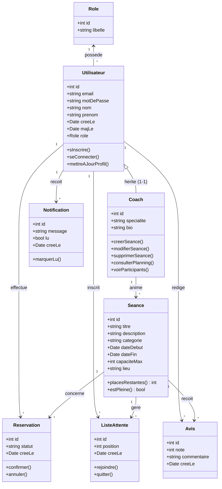

# Diagramme de classes (UML) - Sportify Pro

```mermaid
classDiagram
    class Role {
        +int id
        +string libelle
    }

    class Utilisateur {
        +int id
        +string email
        +string motDePasse
        +string nom
        +string prenom
        +Date creeLe
        +Date majLe
        +Role role
        +sInscrire()
        +seConnecter()
        +mettreAJourProfil()
    }

    class Coach {
        +int id
        +string specialite
        +string bio
        +creerSeance()
        +modifierSeance()
        +supprimerSeance()
        +consulterPlanning()
        +voirParticipants()
    }

    class Seance {
        +int id
        +string titre
        +string description
        +string categorie
        +Date dateDebut
        +Date dateFin
        +int capaciteMax
        +string lieu
        +placesRestantes() int
        +estPleine() bool
    }

    class Reservation {
        +int id
        +string statut
        +Date creeLe
        +confirmer()
        +annuler()
    }

    class ListeAttente {
        +int id
        +int position
        +Date creeLe
        +rejoindre()
        +quitter()
    }

    class Avis {
        +int id
        +int note
        +string commentaire
        +Date creeLe
    }

    class Notification {
        +int id
        +string message
        +bool lu
        +Date creeLe
        +marquerLu()
    }

    Role "1" <-- "*" Utilisateur : possede
    Utilisateur <|-- Coach : herite (1-1)
    Coach "1" --> "*" Seance : anime
    Utilisateur "1" --> "*" Reservation : effectue
    Seance "1" --> "*" Reservation : concerne
    Utilisateur "1" --> "*" ListeAttente : inscrit
    Seance "1" --> "*" ListeAttente : gere
    Utilisateur "1" --> "*" Avis : redige
    Seance "1" --> "*" Avis : recoit
    Utilisateur "1" --> "*" Notification : recoit
```
