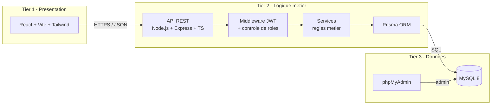

# Architecture technique - Sportify Pro

## Architecture 3-tiers



## Composants

| Composant      | Technologie                          | Role                                          |
|----------------|--------------------------------------|-----------------------------------------------|
| Frontend       | React 18 + Vite + TypeScript + Tailwind | UI utilisateurs (client/coach/admin)         |
| Backend        | Node.js 20 + Express 4 + TypeScript     | API REST                                      |
| Auth           | jsonwebtoken + bcrypt                | Authentification stateless via JWT            |
| ORM            | Prisma 5                             | Acces type-safe a MySQL                       |
| BDD            | MySQL 8                              | Stockage relationnel                          |
| Admin BDD      | phpMyAdmin                           | Inspection / requetes manuelles               |
| Doc API        | swagger-jsdoc + swagger-ui-express   | Documentation interactive `/api/docs`         |
| Tests          | Jest + ts-jest                       | Tests unitaires et d'integration              |
| Conteneurs     | Docker + docker-compose              | Deploiement reproductible                     |
| CI/CD          | GitHub Actions                       | Lint + tests + build a chaque push            |

## Couches du backend

```
src/
  config/        env vars, prisma client, swagger
  middlewares/   auth (JWT), requireRole (RBAC), validate (Zod), errorHandler
  modules/
    auth/        controller + service + routes + validators
    users/       CRUD admin + gestion profil (/me, /me/password)
    coaches/     liste des coaches (GET /coaches)
    seances/     CRUD + participants + filtres + pagination
    reservations/ reservation + annulation + liste d'attente
    avis/        notes et commentaires par seance
    notifications/ notifications in-app (lu/non lu)
  utils/         helpers (jwt, password, errors)
  app.ts         creation Express, routes globales
  server.ts      bootstrap (listen)
prisma/
  schema.prisma  modele de donnees (8 entites)
  seed.ts        donnees de demonstration
  migrations/    migrations SQL versionnees
```

## Securite

- Mots de passe hashes avec bcrypt (10 rounds).
- JWT signe HS256, expiration courte (2h par defaut).
- Middleware d'authentification + middleware de role (RBAC) : chaque route declare le role minimum requis.
- Validation stricte des entrees avec Zod (schemas declares dans `*.validators.ts`).
- CORS restreint a l'origine du frontend.
- Helmet pour les headers HTTP de securite.
- Toutes les FK en base ont `ON DELETE CASCADE` pour eviter les donnees orphelines.
